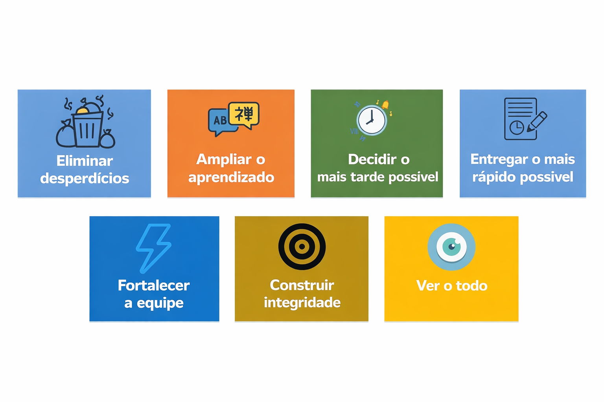

# Lean Development

**Grupo 05 – Metodologia de Desenvolvimento de Sistemas**  
Aluno: Vinicius  

---

# Introdução

Lean Development é uma metodologia de desenvolvimento de software baseada nos princípios do Lean Manufacturing, criado pela empresa Toyota.

O objetivo principal dessa metodologia é **eliminar desperdícios, melhorar a eficiência do desenvolvimento e entregar valor ao cliente de forma rápida e contínua**.

Ao invés de focar apenas em produzir mais código, o Lean Development busca produzir **apenas o que realmente gera valor para o cliente**.

---

---

# Definição e Características

Lean Development é uma abordagem que busca otimizar o processo de desenvolvimento de software através da eliminação de atividades desnecessárias e melhoria contínua do processo.

## Principais características

- Eliminação de desperdícios
- Entrega rápida de software
- Foco no valor para o cliente
- Melhoria contínua
- Equipes colaborativas
- Qualidade integrada ao processo

---

---

# Princípios do Lean Development

O Lean Development é baseado em **7 princípios principais**:

1. Eliminar desperdícios  
2. Amplificar o aprendizado  
3. Decidir o mais tarde possível  
4. Entregar o mais rápido possível  
5. Empoderar a equipe  
6. Construir qualidade no processo  
7. Otimizar o todo  

---

---

# Tipos de Projetos Mais Adequados

Lean Development é mais adequado para projetos que:

- Precisam de entregas rápidas
- Possuem mudanças frequentes
- Buscam melhorar eficiência no desenvolvimento
- Trabalham com equipes colaborativas

### Exemplos de projetos

- Desenvolvimento de aplicativos
- Sistemas web
- Plataformas digitais
- Startups de tecnologia

---

---

# Ferramentas Utilizadas

Algumas ferramentas utilizadas em projetos que aplicam Lean Development incluem:

- Jira
- Trello
- GitHub
- GitLab
- Kanban Boards

---

---

# Vantagens

- Redução de desperdícios
- Maior produtividade da equipe
- Entrega mais rápida de software
- Melhor adaptação a mudanças
- Maior foco no cliente

---

# Desvantagens

- Pode ser difícil de implementar inicialmente
- Exige equipes bem organizadas
- Pode gerar confusão sem uma boa gestão
- Nem sempre funciona bem em projetos muito rígidos

---

# Comparação com Outras Metodologias

| Metodologia | Característica |
|-------------|---------------|
| Scrum | Desenvolvimento em sprints |
| Agile | Flexível |
| DevOps | Integração |
| Spiral | Controle de risco |
| Lean | Eliminar desperdício |

---

# Conclusão

Lean Development é uma metodologia eficiente que busca melhorar o processo de desenvolvimento de software através da eliminação de desperdícios e da entrega contínua de valor ao cliente.

---

# Referências

- Poppendieck, Mary – Lean Software Development  
- Artigos sobre metodologias ágeis  
- Documentação de engenharia de software
