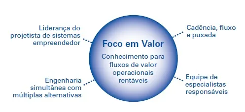
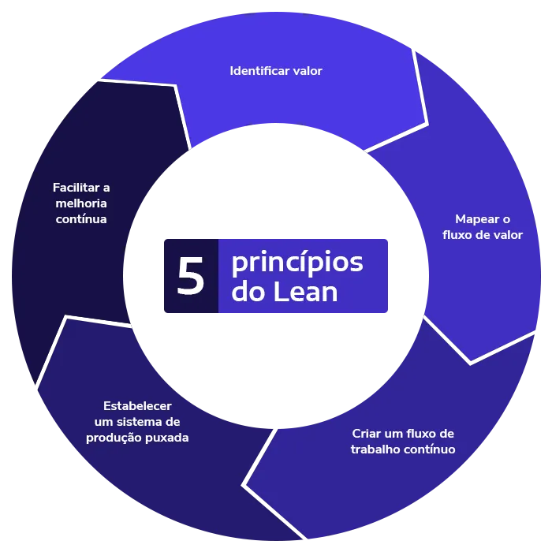
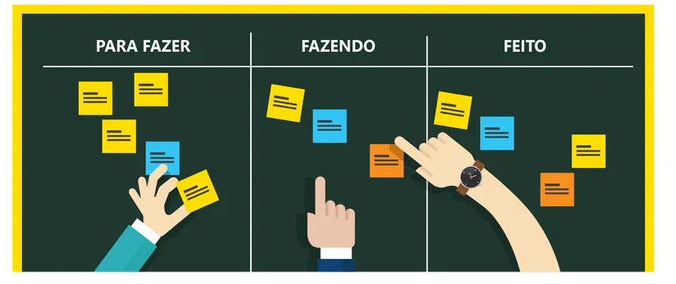

# Lean Development

**Grupo 05 – Metodologia de Desenvolvimento de Sistemas**  
Aluno: Vinicius  

---

# Introdução

Lean Development é uma metodologia de desenvolvimento de software baseada nos princípios do Lean Manufacturing, criado pela empresa Toyota.

O objetivo principal dessa metodologia é **eliminar desperdícios, melhorar a eficiência do desenvolvimento e entregar valor ao cliente de forma rápida e contínua**.

Ao invés de focar apenas em produzir mais código, o Lean Development busca produzir **apenas o que realmente gera valor para o cliente**.

---

---

# Definição e Características

Lean Development é uma abordagem que busca otimizar o processo de desenvolvimento de software através da eliminação de atividades desnecessárias e melhoria contínua do processo.

## Principais características

- Eliminação de desperdícios
- Entrega rápida de software
- Foco no valor para o cliente
- Melhoria contínua
- Equipes colaborativas
- Qualidade integrada ao processo

---

---

# Princípios do Lean Development

O Lean Development é baseado em **7 princípios principais**:

1. **Eliminar desperdícios**  
2. **Amplificar o aprendizado**  
3. **Decidir o mais tarde possível**  
4. **Entregar o mais rápido possível**  
5. **Empoderar a equipe**  
6. **Construir qualidade no processo**  
7. **Otimizar o todo**

---

---

# Tipos de Projetos Mais Adequados

Lean Development é mais adequado para projetos que:

- Precisam de entregas rápidas
- Possuem mudanças frequentes
- Buscam melhorar eficiência no desenvolvimento
- Trabalham com equipes colaborativas

### Exemplos de projetos

- Desenvolvimento de aplicativos
- Sistemas web
- Plataformas digitais
- Startups de tecnologia

---

---

# Ferramentas Utilizadas

- Jira  
- Trello  
- GitHub  
- GitLab  
- Kanban Boards  

---

---

# Vantagens

- Redução de desperdícios
- Maior produtividade da equipe
- Entrega mais rápida
- Melhor adaptação a mudanças

---

# Desvantagens

- Difícil no início
- Precisa de organização
- Pode confundir sem gestão

---

# Comparação com Outras Metodologias

| Metodologia | Característica |
|------------|--------------|
| Scrum | Sprints |
| Agile | Flexível |
| DevOps | Integração |
| Spiral | Controle de risco |
| Lean | Sem desperdício |

---

# Conclusão

Lean Development melhora o processo de software eliminando desperdícios e entregando valor contínuo.

---

# Referências

- Lean Software Development
- Artigos sobre Agile
- Documentação de engenharia de software
